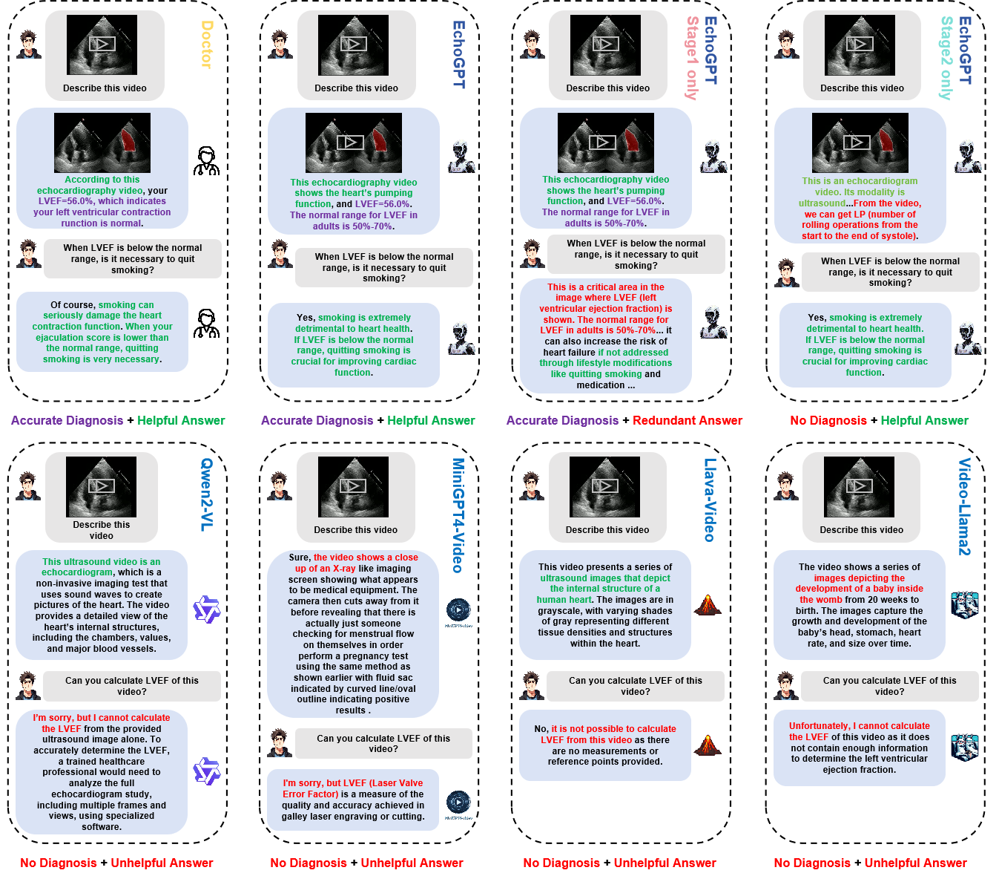

# EchoGPT: An Interactive Cardiac Function Assessment Large Language Model for Echocardiogram Videos


## Demo


You can try our model at .(Our model is deployed on our laboratory server and cannot be deployed for a long time, so if the link is invalidated, please understand. And Our complete source code will be released after the next stage is completed.)

## Framework of EchoGPT


## Ablation and Comparison



## Citation

If you find EchoGPT helpful in your research, pleas cite using this BibTeX:

```

```

## Acknowledgement

- [MiniGPT4-Video](https://github.com/Vision-CAIR/MiniGPT4-video)
- [LLaMa 2](https://huggingface.co/meta-llama/Llama-2-7b-chat-hf)
- [EchoNet-Dynamic](https://github.com/echonet/dynamic)
- [EchoCLIP](https://github.com/echonet/echo_CLIP)
- [Llava-Video](https://huggingface.co/lmms-lab/LLaVA-Video-7B-Qwen2)
- [Qwen2-VL](https://huggingface.co/spaces/Qwen/Qwen2-VL)
- [LongVU](https://huggingface.co/Vision-CAIR/LongVU_Qwen2_7B)
- [Video-LLaMa2](https://huggingface.co/DAMO-NLP-SG/VideoLLaMA2.1-7B-16F)
