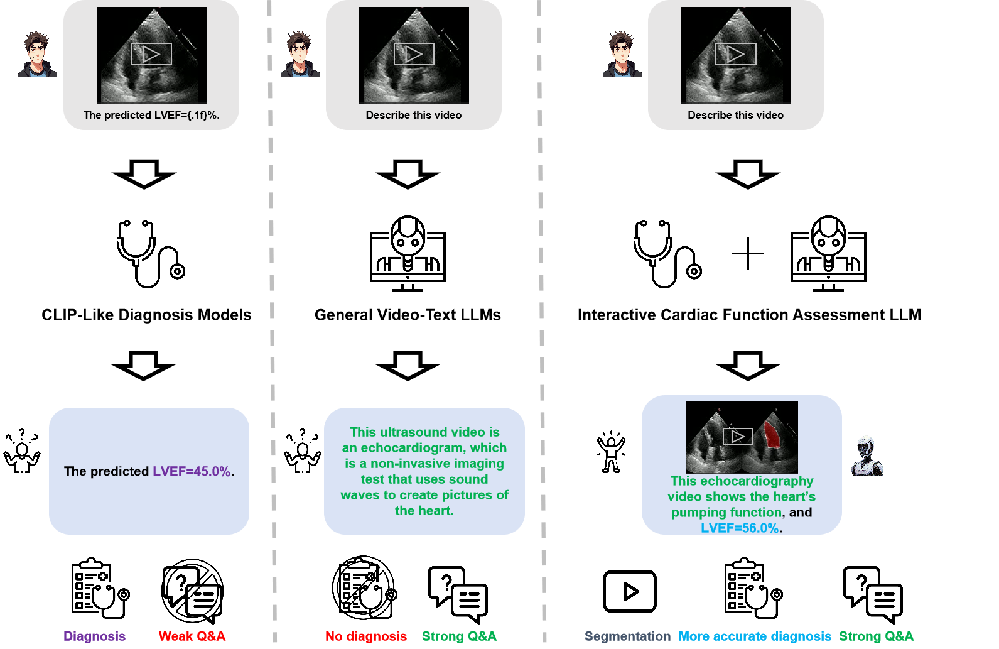

# EchoGPT: An Interactive Cardiac Function Assessment Model for Echocardiogram Videos


## Demo


You can try our model at http://210.30.97.185:7860. (Our model is deployed on our laboratory server and cannot be deployed for a long time, so if the link is invalidated, please understand.)

因为目前有进行商业合作的倾向，所以完整源码暂未进行公开，但是大家可以重点关注Baseline--[MiniGPT-Video](https://github.com/Vision-CAIR/MiniGPT4-video)，它的源码是非常完整的，可以很方便的进行微调。如果大家有对于本论文的疑问或者想要交流医工交叉的想法可以在issue提出，或者联系我本人邮箱--zhuqh19@gmail.com

## Challenge and Our Solution


## Framework of EchoGPT


## Ablation and Comparison


## Next Stage To-do-list

- [ ] Local deployment of EchoGPT on mobile devices
- [ ] Optimize EchoGPT's conversational capabilities using RAG

## Citation

If you find EchoGPT helpful in your research, pleas cite using this BibTeX:

```

```

## Acknowledgement

- [MiniGPT4-Video](https://github.com/Vision-CAIR/MiniGPT4-video)
- [LLaMa 2](https://huggingface.co/meta-llama/Llama-2-7b-chat-hf)
- [EchoNet-Dynamic](https://github.com/echonet/dynamic)
- [EchoCLIP](https://github.com/echonet/echo_CLIP)
- [Llava-Video](https://huggingface.co/lmms-lab/LLaVA-Video-7B-Qwen2)
- [Qwen2-VL](https://huggingface.co/spaces/Qwen/Qwen2-VL)
- [Video-LLaMa2](https://huggingface.co/DAMO-NLP-SG/VideoLLaMA2.1-7B-16F)
